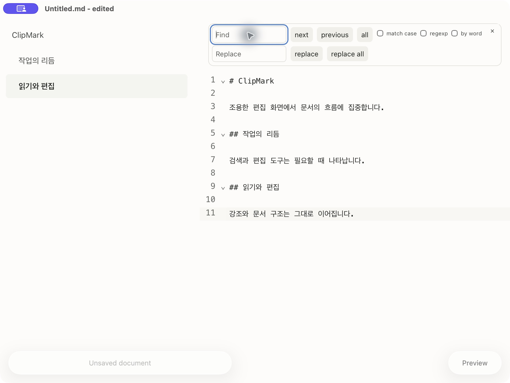
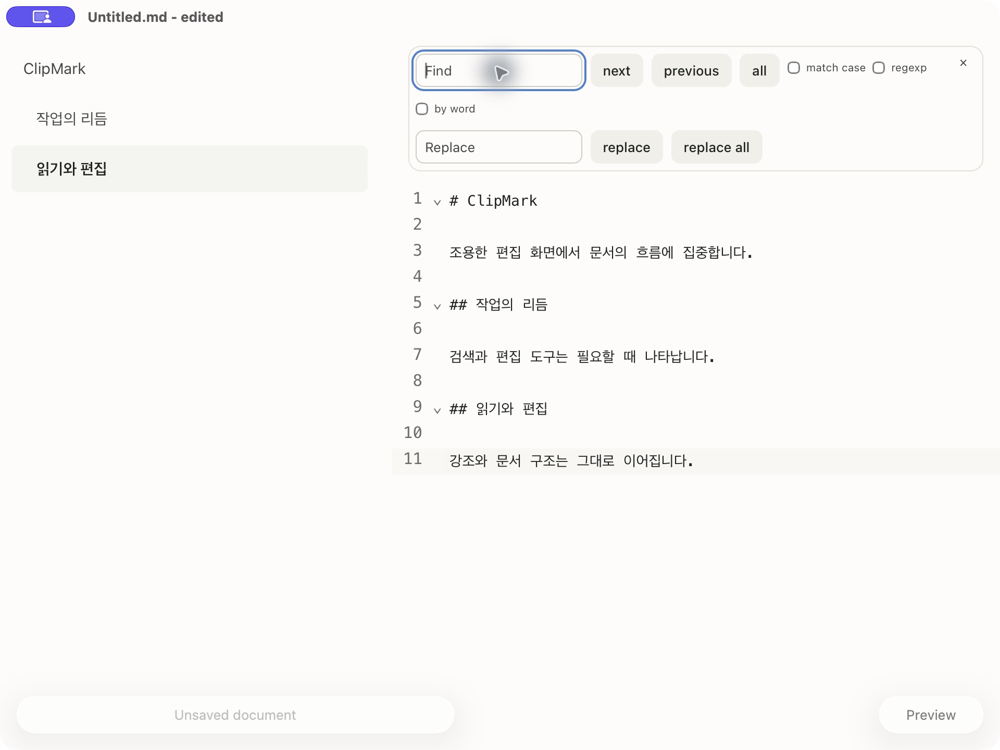

# PR #54 Tauri 앱 전후 비교

- 변경 전: `2f46174` (PR #53 병합 직후 develop)
- 변경 후: `cc014d4` (PR #54 디자인 변경)
- 실제 macOS Tauri 앱 번들, 같은 예시 문서와 검색 입력 포커스.
- 창 960×720pt, 목차 364px, 밝은 테마. 캡처는 1920×1440px.
- 두 앱 모두 npm 잠금 파일 기준 의존성으로 빌드했다.
- 웹 브라우저 캡처는 포함하지 않는다.

| 변경 전 | 변경 후 |
| --- | --- |
|  |  |

검색 패널의 입력·버튼·간격과 네이티브 플로팅 버튼 높이 44→36pt를 비교할 수 있다. macOS WebView의 CSS squircle 지원은 보장하지 않으며, 실제 엔진이 표시하는 곡률을 그대로 캡처했다.
